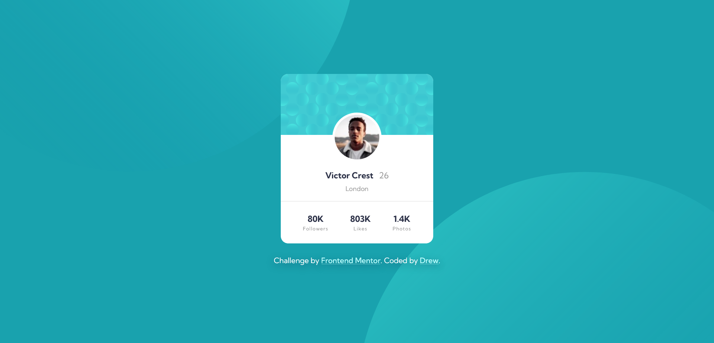

# Frontend Mentor - Profile card component solution

This is a solution to the [Profile card component challenge on Frontend Mentor](https://www.frontendmentor.io/challenges/profile-card-component-cfArpWshJ). Frontend Mentor challenges help you improve your coding skills by building realistic projects.

## Table of contents

- [Overview](#overview)
  - [The challenge](#the-challenge)
  - [Screenshot](#screenshot)
  - [Links](#links)
- [My process](#my-process)
  - [Built with](#built-with)
  - [What I learned](#what-i-learned)
- [Author](#author)

**Note: Delete this note and update the table of contents based on what sections you keep.**

## Overview

### The challenge

- Build out the project to the designs provided

### Screenshot



### Links

- Solution URL: [Click here](https://github.com/24FContreras/FM-profileCardComponent)
- Live Site URL: [Click here](https://24FContreras.github.io/FM-profileCardComponent)

## My process

### Built with

- Semantic HTML5 markup
- CSS custom properties
- Flexbox
- Sass (scss)

### What I learned

The main thing I learned while resolving this challenge lays on the background of the body. I've never positioned two elements before as a background image, so I had to research a bit. I'm happy I learned how to do it, as I'm sure it will an useful tool in future projects.

```scss
//BODY BACKGROUND
background-color: $dark-cyan;
background-image: url(../img/bg-pattern-top.svg),
  url(../img/bg-pattern-bottom.svg);
background-repeat: no-repeat, no-repeat;
background-position: right 50vw bottom 50vh, left 50vw top 50vh;
```

## Author

- Frontend Mentor - [@24FContreras](https://www.frontendmentor.io/profile/24FContreras)
- Github - [@24FContreras](https://github.com/24FContreras)
